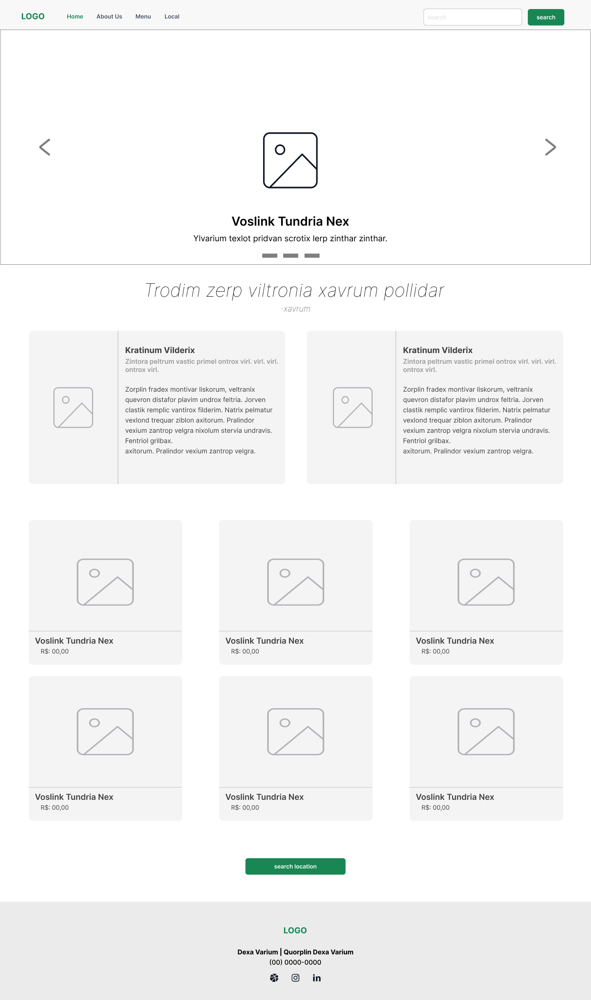

# Wireframe

  

## Descrição  
Wireframe de média fidelidade criado livremente para explorar e planejar o layout de um projeto, desenvolvido durante a formação **UX Designer** da [Digital Innovation One](https://www.dio.me/).

## Ferramenta Utilizada  
- **Figma**

## Funcionalidades Representadas  
- Estrutura básica da página inicial (Home).  
- Posicionamento dos elementos da interface.  
- Fluxo de navegação principal.

## Como Visualizar  
1. Faça o download do arquivo do repositório.  
2. Abra o arquivo no Figma.  
3. Explore o layout e os fluxos propostos.
